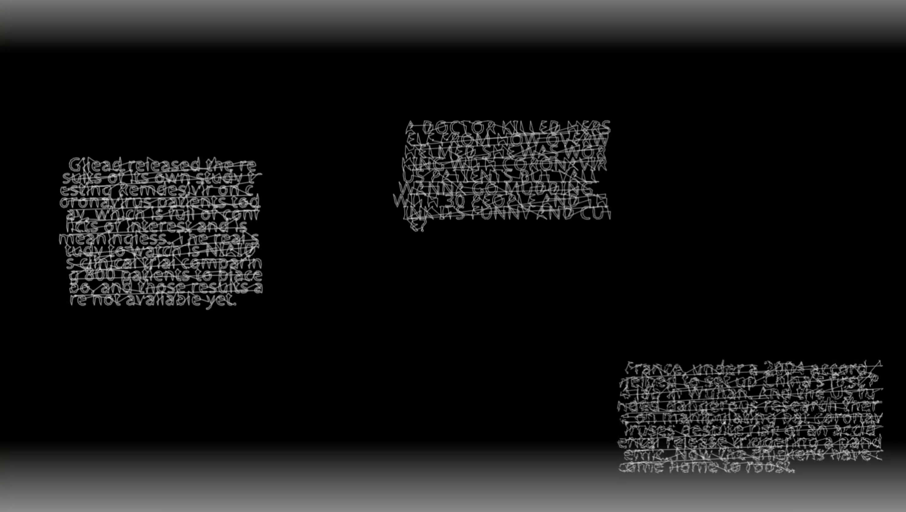
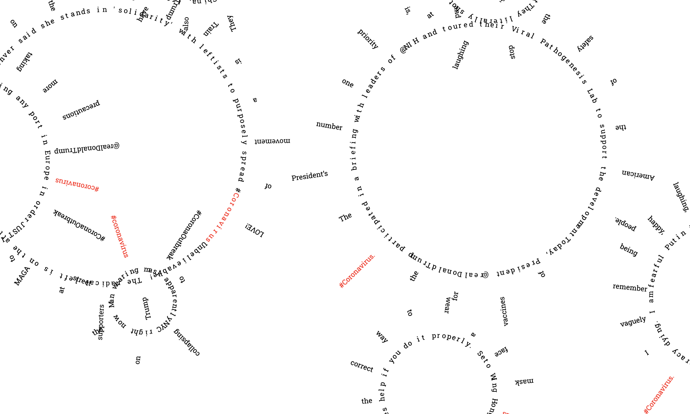

# #coronavirus: a visual poetry

[See the project live!](https://tweet-py.herokuapp.com/) You may have to wait a couple of seconds to see the tweet visualizations to appear.

[Video documentation of the project is also available.](https://www.youtube.com/watch?v=9H2Z-3bM0PQ&feature=youtu.be)

## Technical Details

This project uses [Tweepy](https://www.tweepy.org/) to stream recent tweets filtered by #coronavirus and uses [TextBlob](https://textblob.readthedocs.io/en/dev/index.html) for sentiment analysis to generate the visualizations of the tweets. 3 to 4 tweets are displayed at a given time, and new tweets are continuously retrieved for new visualizations.

The size of the text and the amount of sideways movement depend on how subjective the tweet is. Tweets with positive sentiments travel towards the top, and those with negative sentiments move towards the bottom. If sentiment of a tweet is very negative (score of less than -0.5) then there is added noise to the generated visualization, making the tweets less readable.

The server is written in python with [Flask](https://flask.palletsprojects.com/en/1.1.x/) and uses [socket.io](https://socket.io/) to pass on data (points of the font data for text, raw tweet text, sentiment analysis score) to the web client. Text visualizations are generated by extracting points of font data of the text of the tweets using [Bezmerizing](https://github.com/aparrish/bezmerizing).

## Motivations

Coronavirus (COVID-19) has been the central topic of discussion since early 2020 and has drastically changed our lives. Browsing through Twitter for the latest updates of the situation has highlighted the fact that the top tweets that appear at the top or the most popular retweets often have political motives. Rarely do individuals' tweets appear as the popular tweets when searching through Twitter and I wanted to create an artistic experiment by visualizing recent tweets filtered by #coronavirus and generate them by mapping the subjectiveness and polarity (positive and negative sentiment) of the tweet to various elements of the visualizations.

## Process

### Getting Twitter Stream

For [assignment 4](http://jiwonshin.com/mol/week4/), I had created a jupyter notebook that collected tweets with #coronavirus filter to generate a webpage of concrete poetry in the shape the virus' cellular structure. 

Every time the webpage is generated, the tweets are updated, but the webpage itself doesn't continuously retrieve data. For the final project, I wanted to create a website that streamed the tweets and re-render the visualization with the new tweets. 

## Observations

The simple black and white aesthetics of the text visualizations highlight the differences in how each of the texts are rendered. I had initially thought about incorporating color into the piece, but found the result to be too noisy / messy. 

The results of sentiment analysis through [TextBlob](https://textblob.readthedocs.io/en/dev/index.html) were not necessarily how people would generally assess them. For example, if the tweet has the word "positive" (in the context of "my mother tested positive") the resulting sentiment would be positive when a person reading the tweet would argue that it is not. Thus, the work has an added layer of how a machine learned algorithm would assess people's sentiment and that is being reflected as visualizations of the tweets.

## Thoughts about Future Iteration
